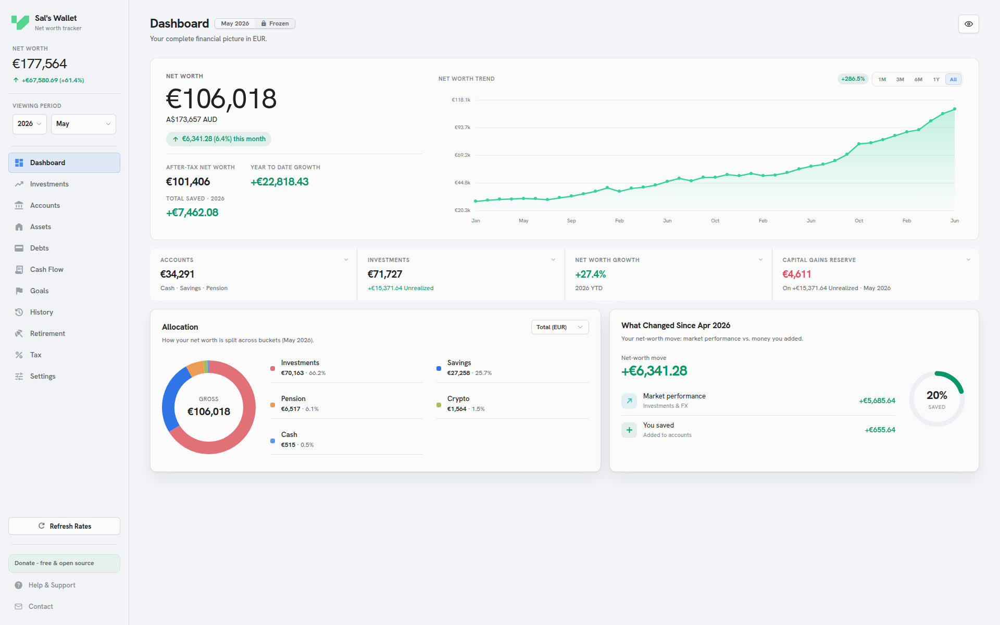
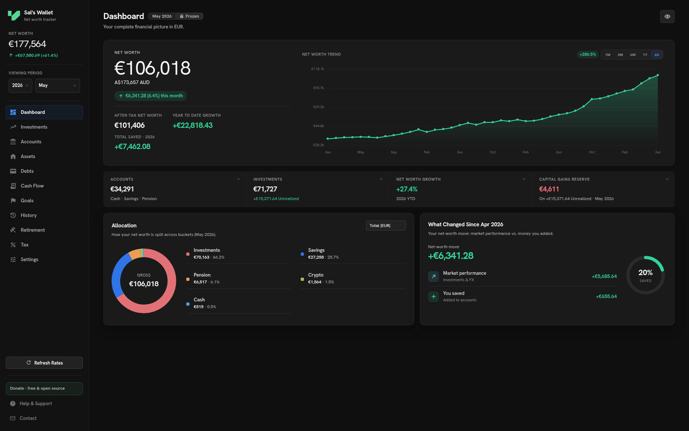
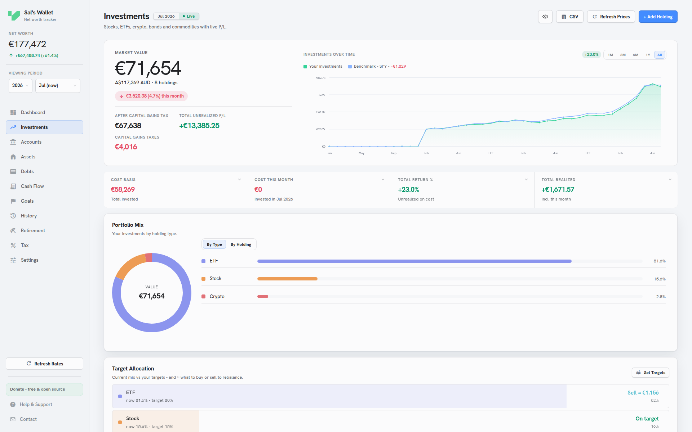
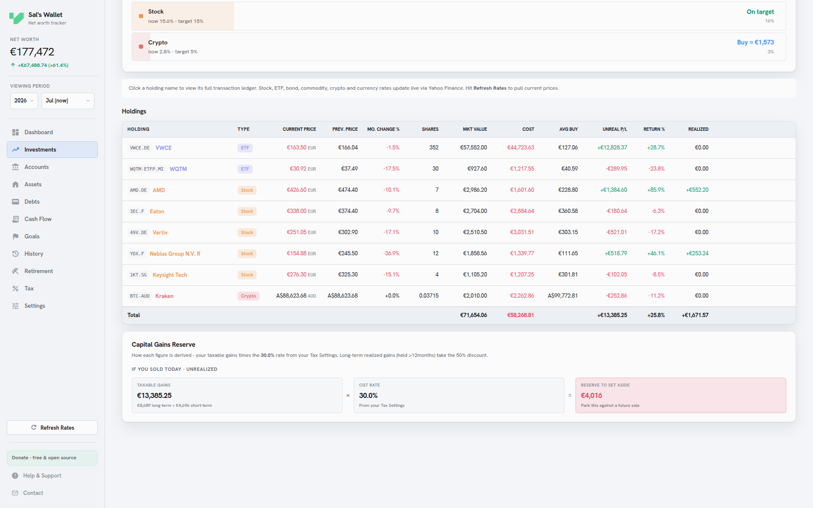
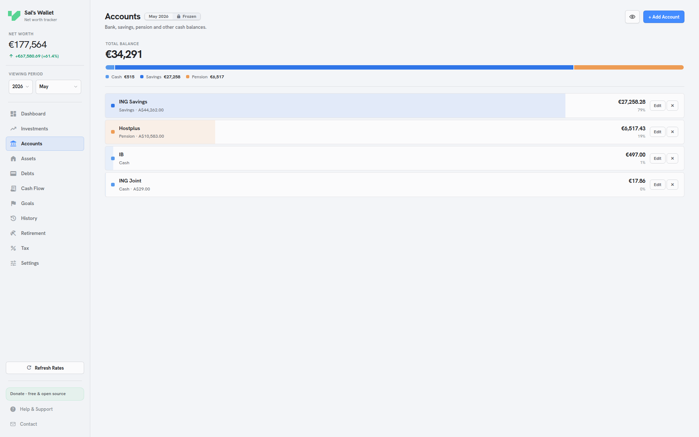
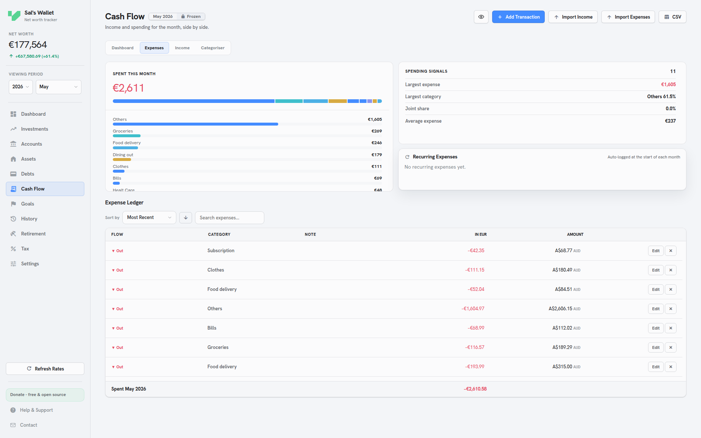
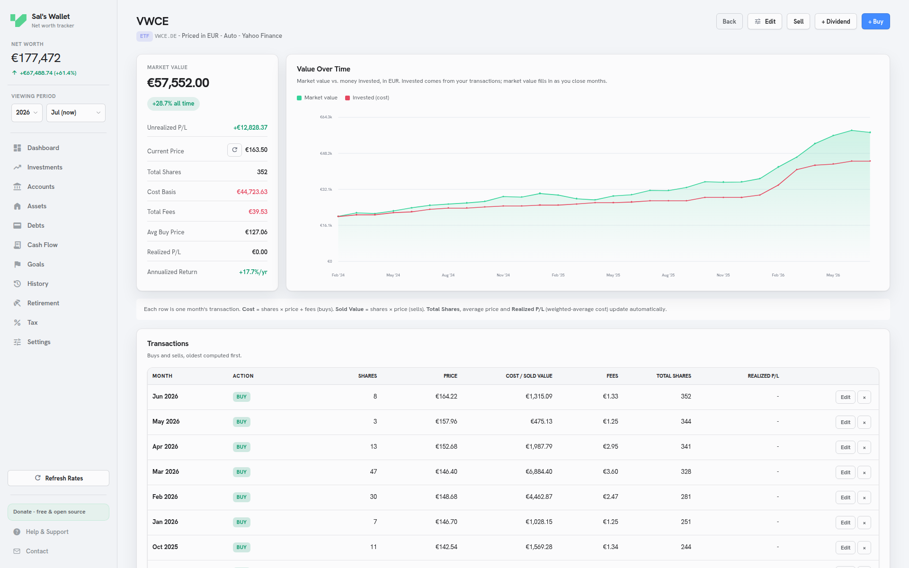
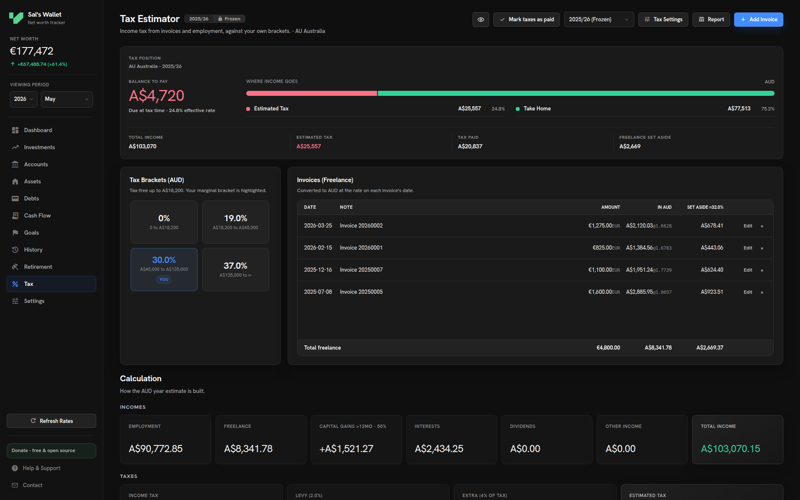
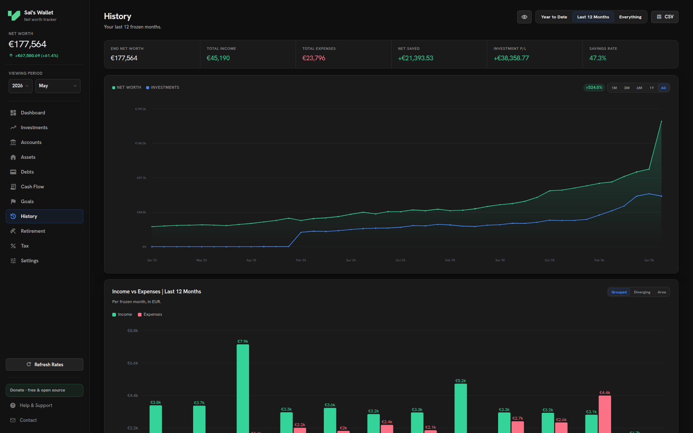
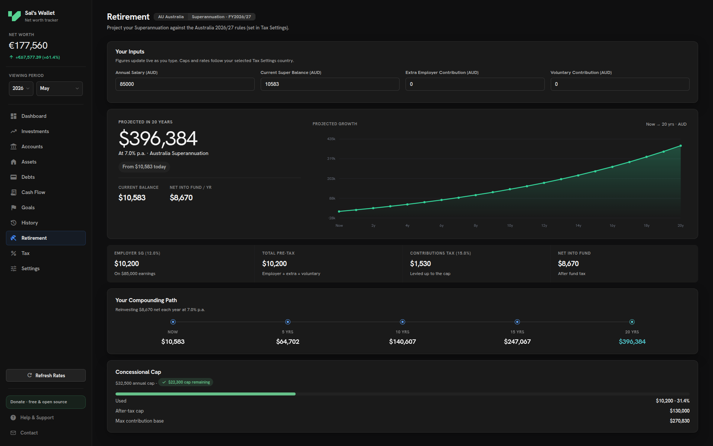

# Valutio

Valutio is a free, open-source, local-first personal finance app for tracking net worth, investments, accounts, cash flow, tax, retirement, goals and history.

It runs in the browser, installs as a PWA, and works offline. There is no account, no cloud sync, no bank connection and no subscription. Your financial data stays in your browser storage unless you export a backup or refresh live market data.

You can also find the app on its website: https://valutio.app/

## Screenshots

Curated demo screenshots are captured with the included demo data. Light mode is the primary presentation; dark mode is available as an optional theme.

[Open the screenshot gallery](Docs/Screenshots/demo/README.md)

| Dashboard | Dark dashboard | 
| --- | --- |
|  |  |

| Investments overview | Investments table |
| --- | --- |
|  |  |

| Accounts | Cash flow expenses | VWCE holding detail |
| --- | --- | --- |
|  |  |  |

| Tax | History | Retirement |
| --- | --- | --- |
|  |  |  |

## Features

| Area | What it covers |
| --- | --- |
| Dashboard | Gross and after-tax net worth, allocation, monthly movement, savings rate and frozen-month views. |
| Accounts | Cash, savings and pension balances in multiple currencies. |
| Investments | Stocks, ETFs, crypto, benchmarks, cost basis, realized P/L, dividends, live prices and full holding ledgers. |
| Cash flow | Current-month dashboard with expenses, income, recurring entries, CSV/Excel ledger imports, and a PDF/CSV statement categoriser with automatic rules and manual review. |
| Tax | Configurable brackets, invoices, capital-gains reserve, paid-year tracking and country presets. |
| Assets and debts | Physical assets, loans, debt interest logging and equity-aware net worth. |
| Goals and retirement | Savings goals and long-term projections that react to balances, contributions and currencies. |
| History | Frozen monthly snapshots, trends and month detail tables. |
| Themes | Dark, light and dim themes with a guided first-run setup. |

## Privacy model

Valutio is local-first:

- The app stores your data in your browser on your device.
- Valutio does not provide accounts, server storage or bank connections.
- Live FX, crypto and market price refreshes send only the symbols/rates being requested to the relevant providers.
- You can export JSON, encrypted JSON and Excel files whenever you want.
- Encrypted backups use AES-256-GCM through the browser Web Crypto API. There is no password recovery.

## Run locally

From this folder, start a static server:

```bash
python3 -m http.server 8123
```

Then open:

```text
http://localhost:8123/
```

The app can also be opened directly from `index.html`, but a local server is the best way to test install/offline behaviour because browsers restrict some PWA features on file URLs.

## Data import and export

Valutio supports:

- Full JSON export and import.
- Password-protected encrypted JSON export and import.
- Spreadsheet-friendly Excel workbook export.
- Excel workbook import with preview. This can replace major wallet sections and is not the full-fidelity backup format.
- Cash-flow imports for income and expenses from CSV, XLS or XLSX.
- Bank-statement categorisation from PDF or CSV, with Personal/Joint assignment, editable rules, reversals, exclusions, manual bulk review, Excel reports, and per-transaction append-only application to Cash Flow. The importer recognises common signed-amount, debit/credit, deposit/withdrawal and running-balance layouts across numeric, named, compact and ISO dates, plus comma, semicolon and tab-delimited exports in common text encodings.
- A full workbook starter template: `Templates/Wallet_Template.xlsx`.
- A cash-flow expenses template: `Templates/expenses_template_valutio.xlsx`.

Use JSON when you want an exact backup or restore. Use Excel when you want to review, edit or migrate structured wallet data.

Personal backups should not be committed to the repository. The `.gitignore` file excludes the usual Valutio backup filename patterns.

## QA and data checks

Run the dependency-free financial regression suite:

```bash
node Scripts/test-financial-logic.mjs
node Scripts/test-statement-categorizer.mjs
```

Validate a JSON backup before sharing, debugging or importing it:

```bash
node Scripts/validate-wallet-backup.mjs path/to/wallet-backup.json
```

Generate a heavier synthetic wallet for manual stress testing:

```bash
node Scripts/generate-stress-wallet.mjs /tmp/valutio-stress-wallet.json
```

Then validate or import the generated JSON in the app and check dashboard, investments, cash flow, history, tax and retirement performance.

## Calculation scope

Valutio is a planning and record-keeping tool, not tax or investment advice. Tax brackets and thresholds are editable because legislation and individual circumstances vary. The built-in tax estimator models the configured income-tax brackets, invoices, capital gains, carried-forward capital losses and paid-year state; it does not attempt to replace a tax return or cover every levy, credit, deduction or jurisdiction-specific exception.

Investment cost basis uses the portfolio's weighted-average purchase cost. Transactions with exact dates receive exact financial-year and capital-gains holding-period treatment. Older backups that only recorded a month retain month-level precision and are treated conservatively where an exact anniversary cannot be proven.

For the complete wallet schema, calculation formulas, snapshot and tax
invariants, migration rules, import/export guarantees, localization conventions,
test matrix and release requirements, read
[`MAINTAINER_GUIDE.md`](MAINTAINER_GUIDE.md) before changing the application.

## Live data providers

FX rates, crypto prices and market prices refresh when online. The app supports editable provider settings under Settings, including Yahoo Finance proxy support for deployed builds and optional keyed providers for stocks/ETFs where needed.

## Release build

The readable source lives in this folder. The public app bundle is copied into `../valutio-deploy/app`.
The public workflow also mirrors `../Website-source/assets/demo` into `../valutio-deploy/assets/demo` for the website demo gallery.

Install the small minifier dependencies once:

```bash
python3 -m pip install rjsmin rcssmin
```

Build only the deployable app payload:

```bash
python3 Scripts/build-deploy.py
```

For a public GitHub-ready export, run:

```bash
bash publish-public.sh
```

Before a public release, bump the service-worker cache version in `sw.js` and the query strings in `index.html` so installed users receive the update prompt. See `PUBLISHING.md` for the full release workflow.

## Project layout

- `index.html`: app shell.
- `app.css`: app styles and theme tokens.
- `app.js`: application logic.
- `statement-categorizer.js`: statement parsing, rules, manual review, Excel reports and append-only Cash Flow application.
- `MAINTAINER_GUIDE.md`: authoritative architecture, data and financial-behavior reference.
- `AGENTS.md`: short repository instructions that point maintainers to the authoritative guide.
- `sw.js`: service worker for install/offline support.
- `manifest.webmanifest`: PWA metadata.
- `Fonts/`: self-hosted Hanken Grotesk and Material Symbols assets.
- `Icons/`: app icons and Valutio brand marks used by the app.
- `Templates/`: Excel starter and cash-flow templates.
- `Vendor/`: SheetJS and PDF.js browser bundles with their licenses for offline Excel and statement PDF support.
- `Deploy/`: hosting redirects and the server-side Yahoo Finance proxy used by deployed builds.
- `Rules/`: contribution, security and trademark policies.
- `Scripts/build-deploy.py`: deploy app builder.
- `Scripts/publish-public.py`: clean GitHub export builder and website demo asset sync.
- `Scripts/test-financial-logic.mjs`: deterministic tax, investment, migration and scale regression tests.
- `Scripts/test-statement-categorizer.mjs`: deterministic statement parsing, classification, reversal, overlap, encoding, scale and application tests.
- `Scripts/validate-wallet-backup.mjs`: JSON backup integrity checker.
- `Scripts/generate-stress-wallet.mjs`: synthetic multi-year test wallet generator.
- `PUBLISHING.md`: first release and update workflow.
- `LICENSE`: AGPL-3.0 license.
- `Rules/TRADEMARKS.md`: Valutio name and logo policy.
- `Rules/CLA.md`: contribution license terms.

## License and trademarks

Valutio is licensed under the GNU Affero General Public License v3.0. See `LICENSE`.

The Valutio name and logos are trademarks of the project maintainer. The code license does not grant trademark rights. See `Rules/TRADEMARKS.md`.

Contributions are accepted under the terms in `Rules/CLA.md`.

## Credits

Valutio's logo and brand mark were designed by [Luca Andria](https://andrialuca.myportfolio.com).

## Support

Valutio is free to use. Donations are optional and help maintain the project:

https://ko-fi.com/salvatoresorvillo
